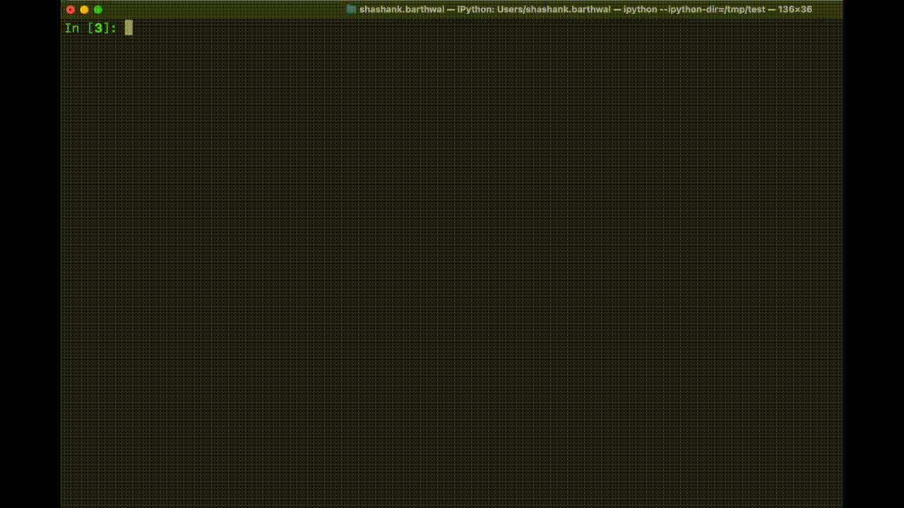

bevigil-cli
=================


`bevigil-cli` provides a unified command line interface and python library for using BeVigil OSINT API.

Getting Started
---------------

Installation
------------

The easiest way to install the BeVigil OSINT CLI is to use [pip](https://pip.pypa.io/en/stable/):

```bash
$ pip3 install bevigil-cli
```

If you already have the bevigil-cli package installed and want to upgrade to the
latest version, you can run:

```bash
$ pip3 install --upgrade bevigil-cli
```

This will install the bevigil-cli package as well as all dependencies.


## Usage
------------

Initialization
------------

Before using the bevigil-cli to extract assets, you need to configure your api key.
You can do this using the ``init`` command:

```bash
$ bevigil-cli init --api-key <API_KEY>
```

To get an API key, you can register at [BeVigil's website](https://bevigil.com/osint-api)


Enumeration
------------

Once the API key is configured, you can request BeVigil's OSINT API for different types of assets. The ``enum`` command consists of subcommands to enumerate different assets collected by BeVigil OSINT API. Following are all the supported subcommands under ``enum`` group including their options.

```
  Enumerate assets using BeVigil OSINT API

Options:
  -h, --help  Show this message and exit.

Commands:
  hosts       Request hosts present in an android package
  packages    Request packages associated associated with a domain/subdomain
  params      Request params associated with an android package
  s3          Request S3 buckets associated with a package or a keyword
  subdomains  Request subdomains associated with a domain
  urls        Request URLs associated with a domain
  wordlist    Request a wordlist for a package
```

Commands Examples
-------------------

`wordlist`
------------

To request a wordlist crafted from an android pacakge:
```bash
$ bevigil-cli enum wordlist --package "com.whatsapp"
```
```
{
   "package_id": "com.whatsapp",
   "raw_wordlist": [
      "header.json",
      "content.json",
      "change_number_contacts.json",
      "manifest.json",
      "client_search.php",
      "metadata.json",
      "verification.php",
      "debuginfo.json",
      "payments_error_map.json",
      "ephemeral_settings_lottie_animation.json",
      "/DCIM/Camera",
      "/native-libs/",
      "/timer/stop:",
      "/cgroup",
      "/bg_non_interactive",
      "/dev/null",
   ]
}
```

`subdomains`
------------
To request subdomains associated with a domain
```bash
$ bevigil-cli enum subdomains --domain "dreamplug.in"
```
```
{
   "domain": "dreamplug.in",
   "subdomains": [
      "app-webview.dreamplug.in",
      "webview-prod.dreamplug.in",
      "merchant-app-prod.dreamplug.in",
      "app-prod.dreamplug.in"
   ]
}
```

`hosts`
------------
To request all the hostnames extracted from an android package
```bash
$ bevigil-cli enum hosts --package "com.whatsapp"
```
```
{
   "package_id": "com.whatsapp",
   "hosts": [
      "faq.whatsapp.com",
      "play.google.com",
      "crashlogs.whatsapp.net",
      "www.whatsapp.com",
      "xmlpull.org",
      "wa.me",
      "static.whatsapp.net",
      "ns.adobe.com",
      "maps.instagram.com",
      "expresswifi.com",
      "graph.facebook.com",
      "www.facebook.com",
      "whatsapp.com",
      "www.messenger.com",
      "maps.google.com",
   ]
}
```

`packages`
------------
To request all the packages associated with a domain or subdomain.
There is a distinction between domain and subdomain in this command. So the appropriate flag should be used depending upon the type of input.
This command returns all the packages that contains an occurence of the input domain/subdomain.

* Requesting packages for domain
```bash
$ bevigil-cli enum packages --domain "dreamplug.in"
```

* Requesting packages for subdomain
```bash
$ bevigil-cli enum packages --subdomain "itunes.apple.com"
```

Packages associated with domain "dreamplug.in":
```
{
   "domain": "dreamplug.in",
   "packages": [
      {
         "package_id": "com.dreamplug.androidapp",
         "app_name": "CRED: Credit Card Bills & More",
         "app_version": "2.1.41.13"
      },
      {
         "package_id": "com.dreamplug.credmerchant",
         "app_name": "Partner Merchant App",
         "app_version": "1.0.15"
      }
   ]
}
```

`params`
------------
To request all the parameters associated with an android package

```bash
$ bevigil-cli enum params --package "com.whatsapp"
```
```
{
   "package_id": "com.whatsapp",
   "url_params": {
      "id": [
         "com.whatsapp.wallpaper"
      ],
      "fields": [
         "base_url,static_base_url,osm_config,url_overr..."
      ],
      "cat": [
         "all"
      ],
      "phone": [
         "%s"
      ],
      "text": [
         "%s"
      ],
      "q": [
         "WAStickerApps"
      ],
      "c": [
         "apps"
      ],
      "product_type": [
         "payments_p2p_fbpay"
      ],
      "india": [
         "1"
      ]
   }
}
```

`s3`
------------
To request all the S3 buckets associated with a package name or a specific keyword.

* Requesting s3 data associated with an android package
```bash
$ bevigil-cli enum s3 --package "com.example.app"
```

* Requesting s3 data based on a keyword
```bash
$ bevigil-cli enum s3 --keyword "healthcare"
```

```
{
   "keyword": "healthcare",
   "s3_buckets": [
      "https://s3-ap-southeast-1.amazonaws.com/upay-pub-assets/merchant/logo/ceylinco-healthcare.png",
      "https://s3.ap-south-1.amazonaws.com/medgreenhealthcarelive/",
      "https://med360.s3.amazonaws.com/prod/cuc/healthcare_service/cuc_default.jpg",
      "https://healthcare-lp-537983768107.s3-ap-northeast-1.amazonaws.com/webview/terms/arida.html",
      "https://healthcare-lp-537983768107.s3-ap-northeast-1.amazonaws.com/webview/arida_use_guide/index.html",
   ]
}
```

`urls`
------------
To request all the parameters associated with an android package

```bash
$ bevigil-cli enum urls --domain "example.com"
```
```
{
   "domain": "example.com",
   "urls": [
      "http://example.com#optional",
      "http://example.com/ANamespace\\",
      "http://example.com/wrapperA-linear-clicktracking3",
      "http://example.com/wrapperB-linear-progress-60%",
      "https://example.com:8080/somewhere/over/the/rainbow",
      "https://www.example.com/resultadotpvzaragoza/prueba",
      "http://example.com/wrapperB-linear-clickthrough",
   ]
}
```

### Demonstration
---
The following media demonstrates how `bevigil-cli` can be used for:
* Extracting URL parameters associated with an android package ID
* Extracting subdomains associated with a domain


## Tab Autocompletion
Tab autocompletion of commands can be activated either by adding an entry manually to your shell config file or using bevigil-cli inbuilt option.

Manually
---------
For auto completion of commands, user needs to write specific entry to their shell file.

### Bash
```bash
$ eval "$(_BEVIGIL_CLI_COMPLETE=bash_source bevigil-cli)" >> ~/.bashrc
```

### Zsh
```bash
$ eval "$(_BEVIGIL_CLI_COMPLETE=zsh_source bevigil-cli)" >> ~/.zshrc
```

### Fish
```bash
$ eval (env _BEVIGIL_CLI_COMPLETE=fish_source bevigil-cli) >> ~/.config/fish/completions/foo-bar.fish
```

Automatically
---------------
```bash
$ bevigil-cli init --api-key <api_key> --autocomplete
```
This command allows bevigil-cli to automatically detect your shell type and write appropriate shell config file with correct entry.

Once the entry is added, user needs to restart the terminal for the changes to take effect.


## Code Integration
------------------
To integrate the tool in your project, simply import the `BeVigil` class from `bevigil` package.

```
In [1]: from bevigil import BeVigil

In [2]: bevigil = BeVigil(api_key = "API_KEY")

In [3]: packages = bevigil.getPackagesFromDomain(domain = "netflix.com")

In [4]: wordlist = bevigil.getUrlsFromDomain(domain = "netflix.com")
```

### Demo
---------
The following media demonstrates how BeVigil class can be utilized for extraction of assets.



Every asset that can be obtained from CLI is accessible through these functions. Following is the list of available functions that you can use in your project to query BeVigil API to extract data.

* `getHostsFromPackage(package_id)` => Takes package ID of an android application as argument and returns JSON data containing hosts extracted from that pacakge.

* `getPackagesFromDomain(domain)` => Takes domain as argument and returns JSON data containing android package IDs associated with that domain.

* `getPackagesFromSubdomain(subdomain)` => Takes subdomain as argument and returns JSON data containing android package IDs associated with that subdomain.

* `getParamsFromPackage(package_id)` => Takes package ID of an android application as argument and returns JSON data containing URL parameters associated with that package ID.

* `getS3bucketsFromKeyword(keyword)` => Takes a keyword as argument and returns JSON data containing S3 bucket URLs associated with the keyword.

* `getS3bucketsFromPackage(package_id)` => Takes package ID of an android application as argument and returns JSON data containing S3 bucket URLs associated with the package ID.

* `getSubdomainsFromDomain(domain)` => Takes domain as argument and returns JSON data containing subdomains associated with the domain.

* `getUrlsFromDomain(domain)` => Takes domain as argument and returns JSON data containing URLs associated with the domain.

* `getWordlistFromPackage(package_id)` => Takes package ID of an android application as argument and returns JSON data containing a wordlist associated with the package ID.
